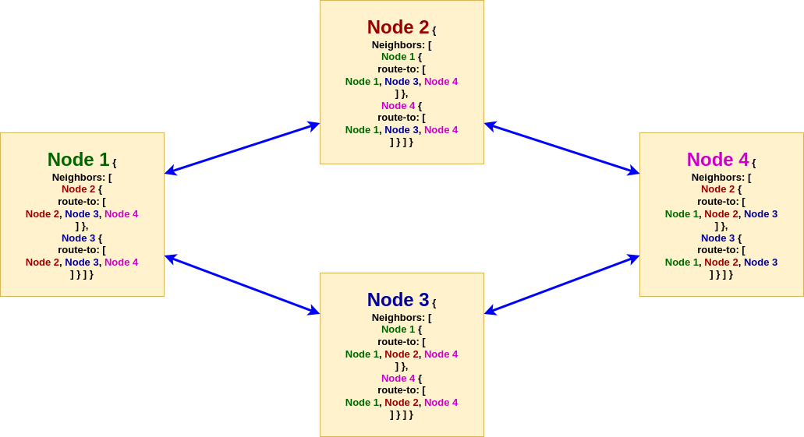

# Algorithm for dynamic routing in a QKD network - formal proof

## Introduction

This code intends to provide a formal proof of security for recursive shared secrets based QKD networks. We [proved previously](https://github.com/thomasarmel/qkd_kme_key_spread/blob/master/formal_verif/qkd_key_spread.pv) that the protocol was safe against passive and active attacker in a context of static routing, meaning all nodes know each others.

Now we wanna ensure that a malicious node isn't able to compromise the whole network. Indeed, as a node is supposed to share its secret between the following nodes in the route, with a secret threshold of 51%, a malicious node could try to make its preceding node believe that it's the only node the victim node is able to communicate with.

The solution we found is quite simple: whenever a node claims to its neighbors it can reach a specific route, all other nodes will ask their respective neighbors if they can also reach this route. This way a malicious node would never be able to claim "I'm the only node able to reach a specific route", in order to have 100% of the secret.


## Installation

Install the **Maude programming language** as explained at https://maude.cs.illinois.edu/w/index.php/The_Maude_System.

Alternatively on Linux you can install it directly from the official repositories:
```bash
sudo apt-get install maude
```

**Note:** The code as been tested with Maude `3.1` and Maude `2.7.1`.

To run the model, simply type
```bash
maude dynamic_routing.maude
```

Or alternatively:
```bash
$ maude
Maude> load dynamic_routing .
```

To quit the Maude interpreter, type:
```
Maude> quit
```

## Model

Let's consider the following 2-nodes network, where both nodes know each-others:


Here *node 1* knows it's linked to *node 2*, and this link is a valid route to reach *node 2*.

The model representation will be:
```maude
n(1, v(2, r(2))) ; n(2, v(1, r(1)))
```

Let's have a closer look to the different functions and separators:

> `n()` used to designate a node. The global state is basically a set of nodes, separated by ` ; ` (spaces around semicolon are mandatory).
>> Parameters:
>>
>> Node number $\in \mathbb{N}$
>>
>> Neighbors set

> `v()` used to designate a neighbor. A node should contain a set of neighbors, separated by ` : ` (spaces around colon are mandatory). Use `empty-neighbour-set` to designate an empty neighbor set (which is practically useless as a node belonging to a network has necessarily neighbors).
>> Parameters:
>>
>> Neighbor node number $\in \mathbb{N}$
>>
>> Set of possible routes (meaning reachable nodes) from this neighbor.

> `r()` used to designate a possible route from a neighbor. A neighbor should contain the exhaustive set of nodes it is able to reach. Possible routes are separated by ` + ` (spaces around the plus are mandatory). Use `empty-neighbour-possible-routing-set` to designate empty routing set. This should not happen normally, as a neighbor should be a route to itself, meaning `v(n, r(n))` is the minimal expression to designate a neighbor.
>> Parameter
>>
>> Route, meaning reachable node number $\in \mathbb{N}$


## The route discovering algorithm

Let be:
- $\Omega$ a set of nodes (possibly empty)
- $\tau, \tau'$ sets of neighbors (possibly empty)
- $\chi, \chi'$ sets (possibly empty) of possible routes from neighbor
- $T, X, Y, Z \in \mathbb{N}$ node numbers
- $N$ set of nodes
- $V$ set of neighbors
- $R$ set of routes from a neighbor
- $n: \mathbb{N} \times \mathcal{P}(V) \rightarrow N$ the function describing a node as explained above
- $v: \mathbb{N} \times \mathcal{P}(R) \rightarrow V$ the function describing a node neighbor, as explained above
- $r: \mathbb{N} \rightarrow R$ the function describing a route from a neighbor, as explained above
- $\delta: \mathcal{P}(N) \rightarrow \mathcal{P}(N)$ the transition function, $\mathcal{P}(N)$ being a state

The route discovering algorithm equation is

$$
\delta(\Omega \ \cup \ \lbrace \ n(Y, \tau' \ \cup \ \lbrace \ v(T, \chi' \ \cup \ \lbrace \ r(Z) \ \rbrace \ ) \ \rbrace \ ) \ \rbrace \ \cup \ \lbrace \ n(X, \tau \ \cup \ \lbrace \ v(Y, \chi) \ \rbrace \ ) \ \rbrace \ ) =
 \begin{cases}
    \Omega \ \cup \ \lbrace \ n(Y, \tau' \ \cup \ \lbrace \ v(T, \chi' \ \cup \ \lbrace \ r(Z) \ \rbrace \ ) \ \rbrace \ ) \ \rbrace \ \cup \ \lbrace \ n(X, \tau \ \cup \ \lbrace \ v(Y, \chi \ \cup \ \lbrace \ r(Z) \ \rbrace \ ) \ \rbrace \ ) \ \rbrace,& \text{if } r(z) \notin \chi \ \text{ and } X \neq Z \text{ and } X \neq T\\
    \Omega \ \cup \ \lbrace \ n(Y, \tau' \ \cup \ \lbrace \ v(T, \chi' \ \cup \ \lbrace \ r(Z) \ \rbrace \ ) \ \rbrace \ ) \ \rbrace \ \cup \ \lbrace \ n(X, \tau \ \cup \ \lbrace \ v(Y, \chi) \ \rbrace \ ) \ \rbrace,              & \text{otherwise (no change)}
\end{cases}
$$

To simplify, at means that at each transition, a node among the network will ask one neighbor about a possible routing, and add the route to the corresponding routing table if:
- the new route isn't the node itself: $X \neq Z$
- the new route doesn't pass through the node itself (otherwise it would create infinite routing loops): $X \neq T$
- the node didn't know the route beforehand: $r(z) \notin \chi$. Formally speaking this condition isn't needed in the equation but it helps understanding how the algorithm works.

The final stable state occurs when all the nodes know all possible routes. An incomplete routing table means the global state isn't final.

## Running examples

In Maude, the syntax to check a **final** state is reachable from an initial state is the following:

```maude
search [1] initial =>! final .
```

- `[1]` means you are looking for **at most** 1 solution
- `=>!` means you want only a solution describing a **final** state (you can check an intermediate state is reachable via `=>*` but it won't prove the security)

In order to check models, you need to loa the `dynamic_routing.maude` file, as explained above.

### Diamond network

Let's assume the network initial state below, where each node knows only that neighbors are valid routes toward themselves:


The global network in initial state is expressed as
```maude
n(1, v(2, r(2)) : v(3, r(3))) ; n(2, v(1, r(1)) : v(4, r(4))) ; n(3, v(1, r(1)) : v(4, r(4))) ; n(4, v(2, r(2)) : v(3, r(3)))
```

The expected final state is the following:



Let's have a closer look on node 1's routing table:

| Target node   |      Via      |  Path              |
|---------------|:-------------:|-------------------:|
| 2             |  2            | 1 -> 2             |
| 2             |  3            | 1 -> 3 -> 4 -> 2   |
| 3             |  2            | 1 -> 2 -> 4 -> 3   |
| 3             |  3            | 1 -> 3             |
| 4             |  2            | 1 -> 2 -> 4        |
| 4             |  3            | 1 -> 3 -> 4        |

This global network in final state is expressed as
```maude
n(1, v(2, r(2) + r(3) + r(4)) : v(3, r(2) + r(3) + r(4))) ; n(2, v(1, r(1) + r(3) + r(4)) : v(4, r(1) + r(3) + r(4))) ; n(3, v(1, r(1) + r(2) + r(4)) : v(4, r(1) + r(2) + r(4))) ; n(4, v(2, r(1) + r(2) + r(3)) : v(3, r(1) + r(2) + r(3)))
```

Let's check that the initial network state leads toward the final stable network state:

```
Maude> search [1] n(1, v(2, r(2)) : v(3, r(3))) ; n(2, v(1, r(1)) : v(4, r(4))) ; n(3, v(1, r(1)) : v(4, r(4))) ; n(4, v(2, r(2)) : v(3, r(3))) =>! n(1, v(2, r(2) + r(3) + r(4)) : v(3, r(2) + r(3) + r(4))) ; n(2, v(1, r(1) + r(3) + r(4)) : v(4, r(1) + r(3) + r(4))) ; n(3, v(1, r(1) + r(2) + r(4)) : v(4, r(1) + r(2) + r(4))) ; n(4, v(2, r(1) + r(2) + r(3)) : v(3, r(1) + r(2) + r(3))) .
[...]
Solution 1 (state 6560)
[...]
```

A solution has been found to reach out the final state from the initial one!


But what happens if :red_circle: **node 2 is malicious** :red_circle: and tries to make node 1 believe that node 3 isn't a route toward node 4?


This can be expressed as follow:

```maude
n(1, v(2, r(2) + r(3) + r(4)) : v(3, r(2) + r(3))) ; n(2, v(1, r(1) + r(3) + r(4)) : v(4, r(1) + r(3) + r(4))) ; n(3, v(1, r(1) + r(2) + r(4)) : v(4, r(1) + r(2) + r(4))) ; n(4, v(2, r(1) + r(2) + r(3)) : v(3, r(1) + r(2) + r(3)))
```
Note `v(3, r(2) + r(3))` in node 1's neighbors, meaning node 1 would think that node 3 cannot be used to reach node 4, and so node 1 would pass through node 2 only, giving it the whole secret :cold_sweat: .

Let's see what happens if we try to reach out this evil final state from the initial one:

```
Maude> search [1] n(1, v(2, r(2)) : v(3, r(3))) ; n(2, v(1, r(1)) : v(4, r(4))) ; n(3, v(1, r(1)) : v(4, r(4))) ; n(4, v(2, r(2)) : v(3, r(3))) =>! n(1, v(2, r(2) + r(3) + r(4)) : v(3, r(2) + r(3))) ; n(2, v(1, r(1) + r(3) + r(4)) : v(4, r(1) + r(3) + r(4))) ; n(3, v(1, r(1) + r(2) + r(4)) : v(4, r(1) + r(2) + r(4))) ; n(4, v(2, r(1) + r(2) + r(3)) : v(3, r(1) + r(2) + r(3))) .
[...]
No solution.
[...]
```

Fortunately, there is **No solution**, meaning this evil state isn't reachable as a final state from the initial state :weary: .


### Basic 2-nodes network

Recall the basic 2-nodes presented in a previous section:


Obviously the initial state is also the final state:

```
Maude> search [1] n(1, v(2, r(2))) ; n(2, v(1, r(1))) =>! n(1, v(2, r(2))) ; n(2, v(1, r(1))) .
[...]
Solution 1 (state 0)
[...]
```


### Flat 3-nodes network

Let's take the following flat network with 3 nodes in final state, where each node knows only its neighbors:


This can be expressed as

```maude
n(1, v(2, r(2))) ; n(2, v(1, r(1)) : v(3, r(3))) ; n(3, v(2, r(2)))
```

The expected final state should be the following:


This will be expressed as

```maude
n(1, v(2, r(2) + r(3))) ; n(2, v(1, r(1)) : v(3, r(3))) ; n(3, v(2, r(1) + r(2)))
```

Please note that in this case, checking the network security is a total nonsense, as **you have to trust Node 2 anyway**.

Let's check if we can reach out the final state from the initial one:

```
Maude> search [1] n(1, v(2, r(2))) ; n(2, v(1, r(1)) : v(3, r(3))) ; n(3, v(2, r(2))) =>! n(1, v(2, r(2) + r(3))) ; n(2, v(1, r(1)) : v(3, r(3))) ; n(3, v(2, r(1) + r(2))) .
[...]
Solution 1 (state 3)
[...]
```


## Find the expected final state from the initial one

In case you want to avoid calculating the final network state by hand, you could use directly the equation provided in the code.

Uncomment the following equation:

```maude
ceq NDS ; n(Y, NS' : v(neighbourNode2, NPRS' + r(Z))) ; n(X, NS : v(Y, NPRS))
  = NDS ; n(Y, NS' : v(neighbourNode2, NPRS' + r(Z))) ; n(X, NS : v(Y, NPRS + r(Z))) if r(Z) in NPRS == false /\ Z =/= X /\ neighbourNode2 =/= X .
```

and comment the rule:

```maude
crl [fetch-routes-rec] : NDS ; n(Y, NS' : v(neighbourNode2, NPRS' + r(Z))) ; n(X, NS : v(Y, NPRS))
 => NDS ; n(Y, NS' : v(neighbourNode2, NPRS' + r(Z))) ; n(X, NS : v(Y, NPRS + r(Z))) if r(Z) in NPRS == false /\ Z =/= X /\ neighbourNode2 =/= X .
```

You would then be able to infer directly the final state from the initial one, using the Maude's `reduce` (abbreviated `red`) command:

```maude
red initial-state .
```

Let's try with the diamond initial state:

```
Maude> red n(1, v(2, r(2)) : v(3, r(3))) ; n(2, v(1, r(1)) : v(4, r(4))) ; n(3, v(1, r(1)) : v(4, r(4))) ; n(4, v(2, r(2)) : v(3, r(3))) .
[...]
result NodeDescSet: n(1, v(2, r(2) + r(3) + r(4)) : v(3, r(2) + r(3) + r(4))) ; n(2, v(1, r(1) + r(3) + r(4)) : v(4, r(1) + r(3) + r(4))) ; n(3, v(1, r(1) + r(2) + r(4)) : v(4, r(1) + r(2) + r(4))) ; n(4, v(2,
    r(1) + r(2) + r(3)) : v(3, r(1) + r(2) + r(3)))
```

We got the final state!